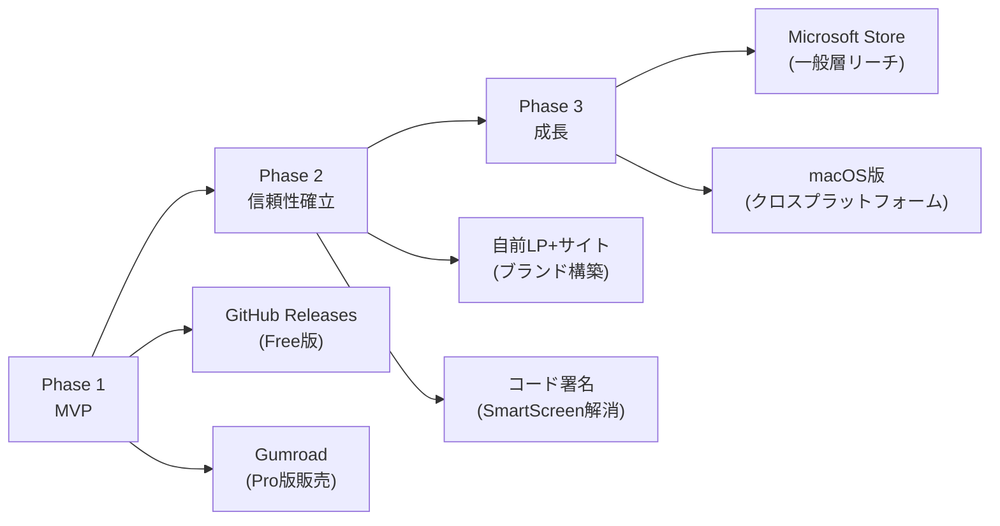

# Aegis AI Hub — マネタイズ戦略タスクリスト

> **作成日**: 2026-05-11  
> **前提**: 現行アーキテクチャ（Electron + Fastify + Gemini API / Windows デスクトップアプリ）

---

## 📊 ビジネスモデル候補と推奨

| モデル | 概要 | 適合度 | 理由 |
|---|---|---|---|
| **Freemium** | 基本無料 + Pro版（月額/年額） | ⭐⭐⭐⭐⭐ | AI機能の段階制限がしやすい。ユーザー獲得→転換の導線が明確 |
| **買い切り** | 一度の購入で永続利用 | ⭐⭐⭐ | シンプルだが継続収益が得にくい。アップデート提供の動機が弱い |
| **サブスクリプション** | 月額/年額での利用権 | ⭐⭐⭐⭐ | 安定収益だが無料版がないと初期獲得が難しい |
| **API代行（マージン型）** | Gemini APIをプロキシし、マージンを上乗せ | ⭐⭐ | Google の利用規約リスクが高い |

> [!IMPORTANT]
> **推奨: Freemium モデル**  
> Free版（自前APIキー必須・基本機能）＋ Pro版（月額 ¥980〜¥1,980 / AI機能フル開放・クラウド同期）

---

## フェーズ 1: 収益化の基盤構築（MVP）

### 1.1 ライセンス・課金基盤

| # | タスク | 詳細 | 工数 |
|---|---|---|---|
| 1.1.1 | **ライセンスキー発行システムの構築** | サーバー側でライセンスキーの生成・検証を行うAPIを構築。Gumroad / LemonSqueezy / Stripe 等のSaaSを利用するか、自前のライセンスサーバーを構築するかを決定 | 大 |
| 1.1.2 | **ライセンス検証モジュールの実装** | `electron/main.cjs` の起動フローにライセンスキー検証ステップを追加。起動時にローカルキャッシュ → オンライン検証のフォールバック付きで認証 | 中 |
| 1.1.3 | **ライセンスキー入力UIの実装** | 初回起動時または「System Settings」にライセンスキー入力フィールドを追加。`ElectronSettingsManager` にキーの安全な永続化（`safeStorage`）を実装 | 中 |
| 1.1.4 | **ライセンス状態のグローバル管理** | `LicenseManager` クラスを新設。`{ tier: 'free' \| 'pro', expiresAt, features }` をアプリ全体で参照可能にする。IPC 経由でフロントエンドにも公開 | 中 |
| 1.1.5 | **オフライン猶予期間の実装** | ネットワーク不通時でも3日間はPro機能を利用可能にするグレースピリオドロジック。最終認証日時をローカルに記録 | 小 |

### 1.2 機能ゲーティング（Free / Pro の差別化）

| # | タスク | 詳細 | 工数 |
|---|---|---|---|
| 1.2.1 | **機能ゲートの設計書作成** | Free版とPro版で利用可能な機能の一覧表を作成。以下は推奨案: | 小 |

**推奨ゲーティング案:**

| 機能 | Free | Pro |
|---|---|---|
| 記事の閲覧・フィルタリング | ✅ | ✅ |
| カテゴリ管理（手動） | ✅ (最大3カテゴリ) | ✅ (無制限) |
| RSS フィード登録 | ✅ (最大20件) | ✅ (無制限) |
| JA Only / レイアウト切替 | ✅ | ✅ |
| **AI カテゴリ提案** | ❌ | ✅ |
| **AI Restructure** | ❌ | ✅ |
| **AI Insights (トレンド探索)** | ❌ | ✅ |
| **AI Discovery (自律探索)** | ❌ | ✅ |
| **Knowledge Graph** | 閲覧のみ | ✅ (操作可) |
| 自動フィードヘルスチェック | 基本 | 高度 (Auto-Recovery) |
| 画像エンリッチメント | ✅ | ✅ |
| データエクスポート (OPML) | ❌ | ✅ |

| # | タスク | 詳細 | 工数 |
|---|---|---|---|
| 1.2.2 | **ゲートチェック関数の実装** | `canUseFeature(featureName: string): boolean` ヘルパーを `LicenseManager` に実装。各IPCハンドラーおよびフロントエンドで参照 | 中 |
| 1.2.3 | **フロントエンドのUI制限** | Pro限定機能のボタンに🔒アイコンを表示。クリック時に「Upgrade to Pro」ダイアログを表示する共通コンポーネント `<ProGate>` を実装 | 中 |
| 1.2.4 | **バックエンドのAPI制限** | IPCハンドラー (`discover-trends`, `restructure-categories` 等) にライセンスチェックを追加。Free版は `LICENSE_REQUIRED` エラーを返す | 小 |
| 1.2.5 | **カテゴリ・フィード数上限の実装** | `syncSettings` 内で `interests.categories` のキー数と `feedConfig` の合計URL数をカウントし、Free版の上限を超える場合はエラーを返す | 小 |

### 1.3 決済フローの統合

| # | タスク | 詳細 | 工数 |
|---|---|---|---|
| 1.3.1 | **決済サービスの選定と契約** | Gumroad（最小工数）/ LemonSqueezy（中間）/ Stripe（最大制御）から選定。日本在住の場合、Stripe は特定商取引法の表示が必要 | 小 |
| 1.3.2 | **購入ページの作成** | 外部ランディングページ（LP）またはアプリ内WebViewでの購入フロー。プラン説明・価格・FAQ を掲載 | 中 |
| 1.3.3 | **Webhook 受信サーバーの構築** | 決済完了時のWebhookを受信し、ライセンスキーを自動発行してメールで送信するバックエンドを構築 | 中 |
| 1.3.4 | **アプリ内アップグレード導線** | 「Upgrade to Pro」ボタンから外部購入ページへ遷移 → 購入完了 → ライセンスキー入力 → アクティベーション のフロー実装 | 中 |

---

## フェーズ 2: 配布と信頼性の確保

### 2.1 アプリ署名と配布

| # | タスク | 詳細 | 工数 |
|---|---|---|---|
| 2.1.1 | **コード署名証明書の取得** | Windows SmartScreen 警告を回避するためのコード署名証明書（EV または OV）を取得。年間 $200〜$500 程度 | 小（手続き） |
| 2.1.2 | **electron-builder の署名設定** | `package.json` の `build.win` に `certificateFile`, `certificatePassword` を追加。CI/CD パイプラインでの自動署名設定 | 小 |
| 2.1.3 | **自動アップデート機能の実装** | `electron-updater` を導入。GitHub Releases または S3 からの差分アップデート配信。Pro版は優先アップデート、Free版は遅延配信などの差別化も可能 | 大 |
| 2.1.4 | **配布チャネルの確立** | 公式サイト（ダウンロードページ）、GitHub Releases、Microsoft Store（オプション）への掲載 | 中 |
| 2.1.5 | **クラッシュレポートの導入** | `electron-log` + Sentry 等を導入。匿名のクラッシュレポートを収集し、品質改善に活用（ユーザー同意必須） | 中 |

### 2.2 マルチプラットフォーム対応

| # | タスク | 詳細 | 工数 |
|---|---|---|---|
| 2.2.1 | **macOS ビルドの対応** | `electron-builder` の macOS 設定追加。Apple Developer Program ($99/年) への登録、公証 (notarization) 対応 | 大 |
| 2.2.2 | **Linux ビルドの対応** | AppImage / deb / snap 形式での配布設定。フォント・パス解決の差異テスト | 中 |
| 2.2.3 | **Web版の検討** | Electron を介さず、Fastify サーバーをクラウドにデプロイしてブラウザから利用するSaaS版。ユーザーベースの最大化に有効だが、アーキテクチャの大規模変更が必要 | 特大 |

---

## フェーズ 3: 法務・コンプライアンス

### 3.1 法的要件

| # | タスク | 詳細 | 工数 |
|---|---|---|---|
| 3.1.1 | **利用規約 (Terms of Service) の作成** | ソフトウェアの利用条件、免責事項、返金ポリシー、知的財産権の帰属を明記 | 中 |
| 3.1.2 | **プライバシーポリシーの作成** | 収集するデータ（利用状況、クラッシュレポート等）、APIキーの取り扱い、データの保存場所を明記。GDPRへの対応も考慮 | 中 |
| 3.1.3 | **特定商取引法に基づく表記** | 日本国内で有料販売する場合、販売者名、住所、連絡先、返品・返金条件の表示が法律で義務付けられている。バーチャルオフィスの利用も検討 | 小 |
| 3.1.4 | **Google Gemini API 利用規約の確認** | 「ユーザーが自身のAPIキーを使用する」モデルが規約に抵触しないかを確認。APIキーの代理利用（マージン型）は規約違反の可能性が高い | 小（調査） |
| 3.1.5 | **OSSライセンスの整理** | 使用している全依存パッケージのライセンス（MIT, Apache, ISC等）を一覧化。`license-checker` 等のツールで自動生成し、アプリ内の「About」に表示 | 小 |
| 3.1.6 | **EULA (End User License Agreement)** | インストーラーに表示するエンドユーザーライセンス契約書。electron-builder の `nsis.license` に設定 | 小 |

### 3.2 セキュリティ強化

| # | タスク | 詳細 | 工数 |
|---|---|---|---|
| 3.2.1 | **ライセンスキーのタンパリング防止** | ローカルに保存されたライセンス情報の改ざんを検知する仕組み（HMAC署名 + サーバー検証）。完全なクラッキング防止は不可能だが、カジュアルな不正利用を抑止 | 中 |
| 3.2.2 | **asar アーカイブの暗号化検討** | `asar` の中身は容易に閲覧可能。`@electron/asar` の暗号化オプションや、ネイティブモジュールへのコアロジック移行を検討 | 中 |
| 3.2.3 | **APIキー保存の監査** | 現在の `ElectronSettingsManager` が `safeStorage` を正しく使用しているか再確認。Pro版ではサーバー側でのAPIキープロキシも選択肢 | 小 |

---

## フェーズ 4: マーケティングと成長

### 4.1 プレゼンス構築

| # | タスク | 詳細 | 工数 |
|---|---|---|---|
| 4.1.1 | **ランディングページ（LP）の作成** | 製品の価値提案、スクリーンショット、デモ動画、価格プラン、ダウンロードリンクを掲載。Next.js / Astro 等で構築 | 大 |
| 4.1.2 | **プロダクトハントへの掲載** | Product Hunt への製品登録。Launch Day の戦略策定（スクリーンショット、デモGIF、説明文の最適化） | 中 |
| 4.1.3 | **GitHub リポジトリの整備** | Free版をOSS（制限付き）として公開し、開発者コミュニティからの注目を集める。Star数がソーシャルプルーフになる | 中 |
| 4.1.4 | **SNS・ブログでの発信** | X (Twitter)、Zenn、Qiita、note 等での開発ストーリーや技術記事の発信。「Gemini API × Electron で作る AI ニュースリーダー」等の技術記事は拡散されやすい | 継続 |
| 4.1.5 | **デモ動画の制作** | 30秒〜1分のプロダクトデモ動画。AI Restructure や Trend Discovery の動作を視覚的に訴求 | 中 |

### 4.2 ユーザー獲得と転換

| # | タスク | 詳細 | 工数 |
|---|---|---|---|
| 4.2.1 | **アプリ内アナリティクスの導入** | 匿名の利用統計（機能使用頻度、セッション時間等）を収集。Free→Pro 転換率の把握とボトルネック分析に必須。Plausible / PostHog 等のプライバシー重視ツールを推奨 | 中 |
| 4.2.2 | **Pro トライアル期間の実装** | 初回インストールから14日間は全機能を無料で試用可能にする。トライアル期限切れ後にFree版へダウングレード | 中 |
| 4.2.3 | **アプリ内ナッジの実装** | Free版ユーザーがPro限定機能を使おうとした時のアップグレード誘導。「3回目のAI操作で制限」→「Pro版なら無制限」等の段階的制限 | 小 |
| 4.2.4 | **紹介プログラム** | 既存ユーザーが新規ユーザーを紹介すると、1ヶ月無料等のインセンティブを提供 | 中 |

---

## フェーズ 5: 付加価値サービス（中長期）

### 5.1 クラウド連携

| # | タスク | 詳細 | 工数 |
|---|---|---|---|
| 5.1.1 | **クラウド同期サービス（Pro限定）** | 複数デバイス間での設定・購読リスト・学習データの同期。Firebase / Supabase 等のBaaSを利用 | 特大 |
| 5.1.2 | **共有プロファイル** | 業界・テーマ別のキュレーション済みプロファイルをコミュニティで共有・販売できるマーケットプレイス | 大 |
| 5.1.3 | **チーム版（B2B）** | 組織内での情報共有を目的としたチームプラン。管理者ダッシュボード、共有フィード設定、ロールベースアクセス | 特大 |

### 5.2 収益多角化

| # | タスク | 詳細 | 工数 |
|---|---|---|---|
| 5.2.1 | **プレミアムプロファイルパックの販売** | 「AI/ML 完全版」「ゲーム業界特化」等の専門的なフィード＋設定パックを追加課金で販売 | 中 |
| 5.2.2 | **APIアクセス（開発者向け）** | Aegis のキュレーション結果をAPIとして外部サービスに提供。月額課金 | 大 |

---

## 🗓️ 優先度マトリックスとロードマップ

### Phase 1（0〜2ヶ月）: 収益化 MVP
```
必須: 1.1.1 → 1.1.2 → 1.1.3 → 1.1.4 → 1.2.1 → 1.2.2 → 1.2.3 → 1.2.4
並行: 1.3.1 → 1.3.2 → 1.3.3 → 1.3.4
法務: 3.1.1 → 3.1.2 → 3.1.3 → 3.1.5
```

### Phase 2（2〜4ヶ月）: 信頼性と配布
```
必須: 2.1.1 → 2.1.2 → 2.1.3 → 2.1.4
品質: 2.1.5 → 4.2.1
マーケ: 4.1.1 → 4.1.5 → 4.1.2
```

### Phase 3（4〜6ヶ月）: 成長
```
転換: 4.2.2 → 4.2.3
拡張: 2.2.1 (macOS)
付加: 5.1.1
```

---

## ⚠️ 注意事項とリスク

> [!WARNING]
> **Google Gemini API の利用規約**  
> ユーザーが自身の API キーを使用するモデル（BYOK: Bring Your Own Key）は現時点で一般的に許容されていますが、「APIキーを代理で使用してマージンを取る」モデルは規約違反のリスクがあります。Pro版で「APIキー不要のAI機能」を提供する場合は、Google Cloud の正式な再販契約が必要になる可能性があります。

> [!CAUTION]
> **Electron アプリのクラッキング耐性**  
> Electron アプリはJavaScriptベースであるため、ライセンスチェックのバイパスが比較的容易です。完全な防止は不可能ですが、以下の多層防御が推奨されます:
> 1. サーバーサイドでのライセンス検証（オンライン時）
> 2. 機能の核心部分をサーバーAPI経由で提供（ローカルに実装しない）
> 3. `asar` の難読化
> 4. 定期的なライセンスチェック（24時間ごと等）

> [!NOTE]
> **最小コストで始める場合**  
> Phase 1 の中でも最小限の実装は「**Gumroad でライセンスキーを販売 + アプリ内でキー検証**」の組み合わせです。Gumroad は決済・ライセンスキー発行・メール送信を一括で処理でき、サーバー構築が不要です。初期投資ゼロで開始できます。

---

## 付録A: 配布方法の詳細比較

Aegis Nexus（Electron デスクトップアプリ）の配布に利用可能な主要チャネルを比較します。

---

### 方法 1: GitHub Releases（自前ホスティング）

**概要**: GitHub リポジトリの Releases 機能にインストーラー（`.exe`）を添付して配布。`electron-updater` と組み合わせて自動アップデートも可能。

| 観点 | 内容 |
|---|---|
| **初期コスト** | 無料 |
| **手数料** | 0% |
| **対象ユーザー** | 開発者・技術者層 |

**メリット:**
- 完全無料で利用可能（帯域制限なし）
- `electron-updater` との統合が標準的でドキュメントも豊富
- OSS コミュニティとの親和性が高く、Star やフォークによるソーシャルプルーフが得られる
- CI/CD（GitHub Actions）と連携して、タグ push で自動リリースが容易
- バージョン管理・Changelog の管理が自然に行える

**デメリット:**
- 決済機能がないため、ライセンスキーの販売・管理は別途サービスが必要
- 一般ユーザー（非エンジニア）にとって GitHub のUIは馴染みがない
- ダウンロード数の分析機能が貧弱（API経由で取得は可能）
- SEO 効果が弱く、検索エンジンからの流入が期待しにくい

**最適な用途**: Free版の配布、OSS版の公開、開発者コミュニティへのリーチ

---

### 方法 2: 自前ダウンロードサイト（LP + S3/Cloudflare R2）

**概要**: Next.js / Astro 等で構築したランディングページ（LP）からダウンロードリンクを提供。インストーラーは S3 や Cloudflare R2 に格納。

| 観点 | 内容 |
|---|---|
| **初期コスト** | ドメイン: 年間 ¥1,000〜¥3,000 / ホスティング: 月額 ¥0〜¥2,000 |
| **手数料** | 0%（決済は別途） |
| **対象ユーザー** | 全ユーザー層 |

**メリット:**
- ブランドイメージを完全にコントロールできる（デザイン・コピー・SEO）
- 製品の価値提案を最適な形で伝えられるLP を自由に設計可能
- Google Analytics / PostHog 等での詳細なユーザー行動分析が可能
- 独自ドメインによるSEO効果とブランド認知の構築
- 決済サービス（Stripe 等）を自由に選択可能

**デメリット:**
- LP の設計・開発・保守コストが発生（工数: 中〜大）
- SSL証明書、CDN設定、帯域管理などのインフラ運用が必要
- ダウンロードサーバーの可用性を自己管理する必要がある
- 決済・ライセンス管理は別途構築が必要

**最適な用途**: ブランド確立後のメイン配布チャネル、Pro版の販売導線

---

### 方法 3: Gumroad

**概要**: デジタル商品の販売に特化したプラットフォーム。ライセンスキーの自動発行、決済、メール送信を一括で処理。

| 観点 | 内容 |
|---|---|
| **初期コスト** | 無料 |
| **手数料** | 10%（無料プラン） |
| **対象ユーザー** | 個人クリエイター向け全般 |

**メリット:**
- **最速で収益化を開始可能**（アカウント作成から数時間で販売開始）
- 決済・ライセンスキー発行・メール送信・返金処理が全て組み込み済み
- サーバー構築が一切不要
- サブスクリプション課金にも対応
- ライセンスキーの検証API（`https://api.gumroad.com/v2/licenses/verify`）を提供しており、アプリ内でのオンライン検証が容易
- アフィリエイトプログラムを簡単に設定可能

**デメリット:**
- 手数料 10% が比較的高い（売上が増えると負担が大きくなる）
- 販売ページのカスタマイズ性が限定的（ブランドイメージの訴求力が弱い）
- 日本語UIが一部不完全
- 独自ドメインでの販売ページ運用に制約あり
- 顧客データの所有権がプラットフォームに依存

**最適な用途**: **MVP フェーズでの最初の配布・販売チャネル**（推奨）

---

### 方法 4: LemonSqueezy

**概要**: Gumroad の代替として急成長中のデジタル商品販売プラットフォーム。税務処理（VAT/消費税）の自動対応が特徴。

| 観点 | 内容 |
|---|---|
| **初期コスト** | 無料 |
| **手数料** | 5% + 決済手数料（約3.5%） |
| **対象ユーザー** | グローバル販売を想定するクリエイター |

**メリット:**
- **グローバルな税務処理を自動化**（VAT、消費税、源泉徴収の計算・申告を代行）
- Merchant of Record（販売代理人）として機能するため、特定商取引法の表記で個人情報を公開する必要がない可能性
- ライセンスキー発行・検証APIを提供
- Gumroad より洗練された販売ページUI
- Webhook による自動化が充実

**デメリット:**
- 合計手数料は約 8.5%（5% + 決済手数料 3.5%）で Gumroad と大差ない
- 比較的新しいサービスのため、長期的な安定性が未知数
- 日本円での支払い受取に為替手数料が発生する場合がある
- Gumroad ほどのコミュニティ規模がない

**最適な用途**: グローバル販売を見据えた中期的な配布チャネル、税務の自動化が重要な場合

---

### 方法 5: Microsoft Store

**概要**: Windows の公式アプリストア経由での配布。MSIX パッケージ形式で提出。

| 観点 | 内容 |
|---|---|
| **初期コスト** | 開発者登録: 約 $19（個人）/ $99（法人） |
| **手数料** | 0%〜15%（カテゴリによる。アプリは原則0%、ゲームは15%。ただしMicrosoft Storeでの直接購入に限る） |
| **対象ユーザー** | Windows 一般ユーザー |

**メリット:**
- Windows ユーザーの自然な発見経路（ストア検索）からの流入が期待できる
- Microsoft の署名による信頼性（SmartScreen 警告が出ない）
- 自動アップデート配信がストア側で管理される
- アプリの手数料が0%であれば、収益面で非常に有利

**デメリット:**
- **MSIX パッケージへの変換作業が必要**（`electron-builder` の設定変更 + テスト）
- 審査プロセスに数日〜数週間かかる場合がある
- ストアのガイドラインに準拠する必要があり、自由度が制限される
- ライセンスキー方式の場合、ストア内課金との整合性に注意が必要
- UWP サンドボックスとの互換性問題が発生する可能性

**最適な用途**: 信頼性の訴求、一般ユーザー層への到達（中長期）

---

### 方法 6: itch.io

**概要**: インディーゲーム・ツールの配布プラットフォーム。「Pay what you want」モデルに対応。

| 観点 | 内容 |
|---|---|
| **初期コスト** | 無料 |
| **手数料** | **販売者が自由に設定可能**（0%〜100%、推奨10%） |
| **対象ユーザー** | インディー・クリエイター層、技術愛好家 |

**メリット:**
- 手数料を販売者が自由に設定可能（0%も選択可）
- 「Pay what you want」や「Name your price」モデルで柔軟な価格設定
- 技術系ツールやゲーム関連のコミュニティが活発
- アップロード・公開が非常に簡単（審査なし）
- バンドル販売やセールの設定が容易

**デメリット:**
- ゲーム寄りのプラットフォームであり、ビジネスツールの訴求力が弱い
- 一般ユーザーの認知度が低い
- サブスクリプション課金に非対応（買い切りのみ）
- ライセンスキー自動発行の仕組みがなく、自前実装が必要
- プロフェッショナルな製品としてのブランドイメージに合わない可能性

**最適な用途**: 初期のユーザー獲得テスト、Free版の認知拡大

---

### 方法 7: Steam

**概要**: 世界最大のPCゲーム・ソフトウェア配信プラットフォーム。近年はユーティリティツールの取り扱いも増加。

| 観点 | 内容 |
|---|---|
| **初期コスト** | アプリ登録料: $100/タイトル |
| **手数料** | 30%（売上 $10M まで）→ 25% → 20% |
| **対象ユーザー** | 世界中のPCユーザー（月間アクティブ: 1.3億+） |

**メリット:**
- **圧倒的なユーザーベース**（月間1.3億以上のアクティブユーザー）
- ストア内検索・レコメンドによる高い露出
- 自動アップデート・DRM・コミュニティ機能が組み込み済み
- Steamワークショップによるコミュニティ拡張（プロファイル共有等）の可能性
- ウィッシュリスト・セール機能による販促

**デメリット:**
- **手数料 30% が非常に高い**
- 審査プロセスが厳格（数週間〜数ヶ月）
- Steam の DRM / ランタイム要件への対応が必要（Steamworks SDK の統合）
- ゲーム以外のツールは発見されにくい傾向
- $100 の初期投資が必要
- 価格設定に制約あり（地域別価格の設定義務）

**最適な用途**: 大規模なユーザーベースへのリーチ（成長期以降）

---

### 方法 8: Web SaaS 版（ブラウザアクセス）

**概要**: Electron を廃止し、Fastify サーバーをクラウドにデプロイ。ブラウザから直接アクセスするSaaS版。

| 観点 | 内容 |
|---|---|
| **初期コスト** | サーバー: 月額 ¥1,000〜¥10,000+ |
| **手数料** | 0%（決済は別途） |
| **対象ユーザー** | 全プラットフォームのユーザー |

**メリット:**
- **プラットフォーム非依存**（Windows / macOS / Linux / モバイル全対応）
- インストール不要で利用開始のハードルが極めて低い
- サーバーサイドでのライセンス制御が完全に可能（クラッキング耐性が最も高い）
- 継続的なデプロイ（CD）による即座のアップデート配信
- ユーザーデータのクラウド管理によるバックアップ・同期が自然に実現

**デメリット:**
- **アーキテクチャの大規模な書き換えが必要**（Electron IPC → REST API / WebSocket）
- サーバー運用コストがユーザー数に比例して増加
- ユーザーのAPIキーをサーバーに預ける設計になり、セキュリティ責任が増大
- Glassmorphism / ネイティブウィンドウ制御等のデスクトップ固有UIが使用不可
- オフライン利用が不可能
- 個人情報の取扱い責任がデスクトップ版より格段に重い

**最適な用途**: ユーザーベースの最大化（長期目標）、モバイル対応

---

### 📊 配布方法の総合比較マトリックス

| 方法 | 初期コスト | 手数料 | 工数 | ユーザー到達力 | ブランド制御 | 推奨フェーズ |
|---|---|---|---|---|---|---|
| **GitHub Releases** | 無料 | 0% | 小 | ⭐⭐ (開発者のみ) | ⭐⭐⭐ | 初期〜継続 |
| **自前サイト** | 低 | 0% | 大 | ⭐⭐⭐ | ⭐⭐⭐⭐⭐ | 中期〜 |
| **Gumroad** | 無料 | 10% | **極小** | ⭐⭐⭐ | ⭐⭐ | **初期（推奨）** |
| **LemonSqueezy** | 無料 | ~8.5% | 小 | ⭐⭐⭐ | ⭐⭐⭐ | 初期〜中期 |
| **Microsoft Store** | $19 | 0%〜15% | 中 | ⭐⭐⭐⭐ | ⭐⭐ | 中期〜 |
| **itch.io** | 無料 | 0%〜自由 | 極小 | ⭐⭐ | ⭐⭐ | 初期テスト |
| **Steam** | $100 | **30%** | 大 | ⭐⭐⭐⭐⭐ | ⭐ | 成長期〜 |
| **Web SaaS** | 月額 | 0% | **特大** | ⭐⭐⭐⭐⭐ | ⭐⭐⭐⭐⭐ | 長期目標 |

---

### 🎯 推奨配布戦略（段階的アプローチ）



**Phase 1（即時開始）:**
1. **GitHub Releases** で Free版を配布（コスト0・工数0）
2. **Gumroad** で Pro版ライセンスキーを販売（コスト0・工数 極小）

**Phase 2（収益発生後）:**
3. **自前LP** を構築してブランドを確立、Gumroad の購入リンクを埋め込み
4. **コード署名証明書** を取得して SmartScreen 警告を解消

**Phase 3（ユーザー数増加後）:**
5. **Microsoft Store** へ掲載して一般ユーザー層を獲得
6. **macOS版** の提供でクロスプラットフォーム展開


### 🔍 Electron デスクトップアプリにおける広告の前提知識

Electron アプリは内部的にChromium ブラウザを使用しているため、**技術的にはWeb広告の表示が可能**です。ただし、通常のWebサイトとは異なる固有の制約と課題があります。

#### デスクトップアプリ広告の特殊性

| 項目 | Webサイト | Electron アプリ |
|---|---|---|
| 広告ネットワーク対応 | ほぼ全て利用可能 | **制限あり**（Google AdSense は規約上使用不可） |
| ユーザーの期待 | 広告表示を許容する文化がある | **広告なし** を期待する傾向が強い |
| インストール型特性 | — | アンインストールのハードルが低い（不満→即削除） |
| プライバシー規制 | Cookie 同意で対応 | より厳格な同意プロセスが必要 |
| 表示面積 | 多い | **限られたウィンドウ内で競合** |

---

### 広告手法の比較

#### 手法 1: ネイティブ広告（自社配信）

**概要**: 自社で広告主を獲得し、アプリ内に直接広告を表示。記事カードと同じデザインで「Sponsored」ラベル付きの広告コンテンツを配置。

**実装例:**
```
┌─────────────────────────────────────┐
│ 📰 記事カード（通常）               │
├─────────────────────────────────────┤
│ 💼 Sponsored · AWS Japan            │  ← ネイティブ広告
│ 「AI開発を加速する新サービス」       │
├─────────────────────────────────────┤
│ 📰 記事カード（通常）               │
└─────────────────────────────────────┘
```

| 観点 | 評価 |
|---|---|
| **収益ポテンシャル** | ⭐⭐⭐⭐⭐（高単価：CPM $10〜$50） |
| **UX への影響** | ⭐⭐⭐⭐（自然な統合が可能） |
| **実装工数** | 中（広告表示コンポーネント + 配信API） |
| **運用工数** | **特大**（広告主の営業・交渉・入稿管理） |

**メリット:**
- 記事フィードに自然に溶け込むため、UXの毀損が最小
- 広告単価を自由に設定可能（技術者向け = 高CPM）
- ユーザーの興味カテゴリに基づいた精密なターゲティングが可能（データは既に `interests.json` にある）
- 第三者のトラッキングスクリプト不要（プライバシー上有利）

**デメリット:**
- **広告主の獲得・交渉を自力で行う必要がある**（個人開発者には非現実的）
- ユーザー数が少ないうちは広告主が見つからない
- 広告コンテンツの入稿・管理システムの構築が必要
- 最低でも MAU（月間アクティブユーザー）10,000〜 がないと成立しない

**適合度**: ⭐⭐（ユーザー規模が拡大した後の選択肢）

---

#### 手法 2: アフィリエイト広告

**概要**: Amazon アソシエイト、楽天アフィリエイト、A8.net 等のアフィリエイトプログラムに参加。記事内容に関連する製品リンクを表示。

**実装例:**
```
┌─────────────────────────────────────┐
│ 📰 「RTX 5090 レビュー」           │
│                                     │
│ 🛒 関連製品: RTX 5090 ¥289,980     │  ← アフィリエイト
│    [Amazon で見る]                   │
└─────────────────────────────────────┘
```

| 観点 | 評価 |
|---|---|
| **収益ポテンシャル** | ⭐⭐⭐（購入時のみ報酬：1〜8%） |
| **UX への影響** | ⭐⭐⭐⭐（関連性が高ければ有用な情報になる） |
| **実装工数** | 中（記事のキーワードから関連商品を検索するロジック） |
| **運用工数** | 小（商品リンクは自動生成可能） |

**メリット:**
- ユーザーの興味分野（ゲーム、PC、オーディオ等）と商品カテゴリが直接一致
- 「記事を読む → 関連製品を見る」は自然な導線であり、UXの毀損が小さい
- Amazon Product Advertising API 等で自動化が可能
- 初期ユーザー数が少なくても開始可能
- 広告主との交渉が不要

**デメリット:**
- 報酬が購入に依存するため、収益が不安定
- Amazon アソシエイトの報酬率は 1〜8%（カテゴリにより変動）で、高額な収益は見込みにくい
- アフィリエイトリンクであることの開示義務（景品表示法・ステマ規制）
- 記事コンテンツが第三者のRSSフィードであるため、そこにアフィリエイトを付けることの倫理的問題
- Electron アプリ内での外部リンク遷移はユーザー体験を中断させる

**適合度**: ⭐⭐⭐（技術系コンテンツとの相性は良いが、倫理面の検討が必要）

---

#### 手法 3: 広告ネットワーク（第三者配信）

**概要**: Carbon Ads、EthicalAds、BuySellAds 等の開発者向け広告ネットワークを利用。バナーやテキスト広告を表示。

| ネットワーク | 対象 | CPM | Electron対応 |
|---|---|---|---|
| **Carbon Ads** | 開発者・デザイナー | $2〜$5 | ⚠️ 要確認（Web向け） |
| **EthicalAds** | OSS / 技術系 | $2〜$4 | ⚠️ 要確認 |
| **BuySellAds** | 技術・クリエイター | $1〜$10 | ⚠️ 要確認 |
| ~~Google AdSense~~ | 一般 | $1〜$3 | ❌ **デスクトップアプリでの使用は規約違反** |

| 観点 | 評価 |
|---|---|
| **収益ポテンシャル** | ⭐⭐（低CPM × 限定的な表示回数） |
| **UX への影響** | ⭐⭐（バナー広告はデスクトップアプリでは違和感が大きい） |
| **実装工数** | 小（スクリプト埋め込み） |
| **運用工数** | 極小（ネットワーク側が管理） |

**メリット:**
- 実装が最も簡単（HTMLにスクリプトタグを追加するだけ）
- 運用負担がほぼゼロ
- Carbon Ads / EthicalAds は開発者ツールとの親和性が高い
- プライバシーに配慮したネットワーク（EthicalAds）は行動追跡なし

**デメリット:**
- **ほとんどの広告ネットワークは Electron / デスクトップアプリでの利用を想定していない**（規約違反の可能性）
- Glassmorphism デザインとバナー広告の視覚的不調和
- CPM が低い（$2〜$5）× DAU が少ない = **月収数百円レベル**にしかならない可能性
- 第三者のトラッキングスクリプトの導入はプライバシーリスク
- 広告ブロッカーによるブロック（Electron 内でも動作するものがある）

**適合度**: ⭐（収益性が低く、UX毀損のリスクが高い）

---

#### 手法 4: スポンサーシップ

**概要**: 特定企業からの協賛を受け、アプリ内に「Powered by ○○」や起動スプラッシュにロゴを表示。

| 観点 | 評価 |
|---|---|
| **収益ポテンシャル** | ⭐⭐⭐⭐（月額固定：交渉次第） |
| **UX への影響** | ⭐⭐⭐⭐⭐（最小限の表示で済む） |
| **実装工数** | 極小（ロゴ表示のみ） |
| **運用工数** | 大（スポンサー獲得の営業活動） |

**メリット:**
- UX への影響が最小（ロゴ1つのみ）
- 固定収益で安定
- ブランド価値を毀損しにくい
- 「Sponsored by」はプロフェッショナルな印象すら与える

**デメリット:**
- スポンサーの獲得が最大のハードル（MAU 数千〜数万が目安）
- 個人開発者が営業活動を行うのは時間的に困難
- スポンサー契約の交渉・法務対応が必要
- 依存度が高い（1社に依存するとリスク）

**適合度**: ⭐⭐（将来的には有力だが、初期フェーズでは非現実的）

---

#### 手法 5: Free版限定のアップグレード誘導バナー（自社広告）

**概要**: 外部広告ではなく、**自社の Pro版への誘導バナー** を広告枠として活用。Free版ユーザーにのみ表示。

**実装例:**
```
┌─────────────────────────────────────┐
│ ✨ Upgrade to Pro                    │
│ AI Insights & Discovery を解放       │
│ [¥980/月で始める]                    │
└─────────────────────────────────────┘
```

| 観点 | 評価 |
|---|---|
| **収益ポテンシャル** | ⭐⭐⭐⭐（Pro転換率に直結） |
| **UX への影響** | ⭐⭐⭐⭐（適切な頻度なら許容される） |
| **実装工数** | 極小 |
| **運用工数** | 極小 |

**メリット:**
- 外部広告と異なり、**直接的に自社収益（Pro版転換）に貢献**
- 表示内容を完全にコントロール可能
- Glassmorphism デザインに統一した美しいバナーを設計可能
- ユーザーの利用パターンに応じた最適なタイミングで表示（例：AI機能を使おうとした時）
- プライバシーリスクなし

**デメリット:**
- 直接的な広告収入は発生しない（間接的にPro版売上に貢献）
- 表示頻度が高いと不快感を与え、アンインストールのリスク

**適合度**: ⭐⭐⭐⭐⭐（**Freemium モデルとの併用で最も効果的**）

---

#### 手法 6: データ収益化（匿名トレンドデータの販売）

**概要**: ユーザーの閲覧傾向を**完全匿名化・集計**した「技術トレンドレポート」を企業向けに販売。

| 観点 | 評価 |
|---|---|
| **収益ポテンシャル** | ⭐⭐⭐（データ量に依存） |
| **UX への影響** | ⭐⭐⭐⭐⭐（ユーザーには見えない） |
| **実装工数** | 大（集計・匿名化パイプライン） |
| **運用工数** | 大（レポート生成・販売） |

**メリット:**
- UIに一切影響を与えない
- 「技術者が今何に関心を持っているか」のデータは企業にとって高価値
- BYOK モデルなので個人のAPIキーは収集しない設計は維持

**デメリット:**
- **個人情報保護法・GDPR への厳格な対応が必須**（明示的な同意取得）
- ユーザーの信頼を失うリスクが極めて高い
- 匿名化の完全性を証明する必要がある
- ユーザー数が数万規模でないと統計的に意味のあるデータにならない
- 倫理的な批判を受ける可能性

**適合度**: ⭐（リスクが高く、推奨しない）

---

### 📊 広告手法の総合比較

| 手法 | 収益性 | UX影響 | 実現性 | 適合度 | 推奨 |
|---|---|---|---|---|---|
| ネイティブ広告（自社配信） | ⭐⭐⭐⭐⭐ | ⭐⭐⭐⭐ | ⭐（営業必要） | ⭐⭐ | 将来的 |
| アフィリエイト | ⭐⭐⭐ | ⭐⭐⭐⭐ | ⭐⭐⭐⭐ | ⭐⭐⭐ | 補助的 |
| 広告ネットワーク | ⭐⭐ | ⭐⭐ | ⭐⭐ | ⭐ | 非推奨 |
| スポンサーシップ | ⭐⭐⭐⭐ | ⭐⭐⭐⭐⭐ | ⭐ | ⭐⭐ | 将来的 |
| **自社Pro誘導バナー** | ⭐⭐⭐⭐ | ⭐⭐⭐⭐ | ⭐⭐⭐⭐⭐ | ⭐⭐⭐⭐⭐ | **最推奨** |
| データ収益化 | ⭐⭐⭐ | ⭐⭐⭐⭐⭐ | ⭐ | ⭐ | 非推奨 |

---

### 🎯 Aegis Nexus における広告戦略の結論

> [!IMPORTANT]
> **外部広告は現時点で非推奨です。** 以下の理由から、Freemium + 自社Pro誘導バナーの組み合わせが最適です。

#### 外部広告を推奨しない理由

1. **ブランドイメージの毀損**: Aegis Nexus は「プレミアム・インテリジェンス・コマンドセンター」を標榜しています。Glassmorphism の洗練されたUIに第三者のバナー広告を表示すると、製品の世界観が破壊されます
2. **デスクトップアプリの慣習**: ユーザーはデスクトップアプリに広告を期待しません。広告表示はアンインストールの直接的な動機になります
3. **収益性の低さ**: DAU 1,000 × CPM $3 の場合、**月収わずか約 $90（約¥13,000）**。Pro版 1人の月額課金（¥980）の方が圧倒的に効率的です
4. **規約リスク**: Google AdSense を含む主要な広告ネットワークは、デスクトップアプリでの使用を規約で禁止または制限しています
5. **プライバシーリスク**: 第三者トラッキングスクリプトの導入は、ユーザーの信頼を損なう要因になります

#### 推奨ハイブリッド戦略

```
┌──────────────────────────────────────────────────┐
│  Free版                                          │
│  ┌──────────────────────────────────────────┐    │
│  │ 自社Pro誘導バナー（記事フィード内に表示） │    │
│  │ + Pro機能ボタンに🔒アイコン               │    │
│  └──────────────────────────────────────────┘    │
│                     ↓ 転換                        │
│  Pro版（広告完全なし・全機能開放）                │
└──────────────────────────────────────────────────┘

  補助収益（オプション）:
  + アフィリエイト（記事に関連する技術書・デバイスのリンク）
    ※ Free/Pro 両方に表示可、または Free限定
```

#### 実装タスク（採用する場合）

| # | タスク | 詳細 | 工数 |
|---|---|---|---|
| B.1 | **Pro誘導バナーコンポーネント** | `<UpgradeBanner>` を実装。記事カード5枚ごとに1回表示。Glassmorphism スタイルに統合 | 小 |
| B.2 | **表示頻度のA/Bテスト基盤** | バナーの表示頻度（3枚ごと / 5枚ごと / 10枚ごと）を設定で変更可能にし、転換率を最適化 | 小 |
| B.3 | **アフィリエイトリンク自動生成** | 記事のキーワードに基づき、Amazon PA-APIで関連商品を自動取得し、記事カード下部に「関連製品」として表示 | 中 |
| B.4 | **アフィリエイト開示バナー** | 景品表示法・ステマ規制に準拠した開示文（「※ アフィリエイトリンクを含みます」）を表示 | 極小 |

> [!TIP]
> **収益の期待値比較（DAU 1,000 の場合）:**
> - 広告ネットワーク: 月 ¥10,000〜¥15,000
> - アフィリエイト: 月 ¥5,000〜¥30,000（購入率に依存）
> - **Pro版（転換率5%）: 月 ¥49,000**（50人 × ¥980）
> 
> → Pro版の転換に集中する方が、広告の10倍以上の収益効率です
