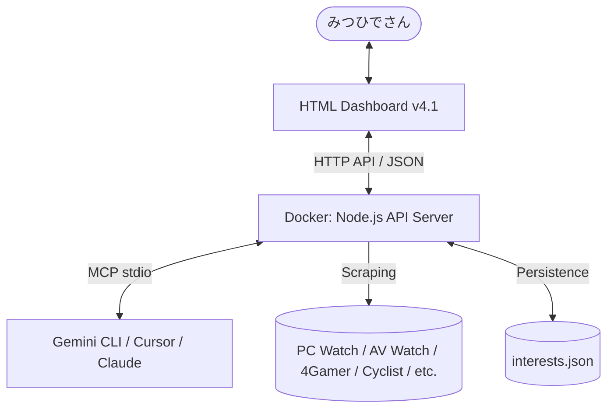

# 🚀 Gadget Concierge Plus (GC+) v4.1

みつひでさんのための、学習型ガジェット情報基盤 & インタラクティブ・ダッシュボード。
最新のテックニュースを自律的にスクレイピングし、エンジニア目線でパーソナライズされた情報を提供します。

---

## 📝 プロジェクト概要

`Gadget Concierge Plus` は、特定のブランドやキーワード（Ryzen, Minisforum, Razer, ギター機材, ロードバイクなど）に基づき、日本語の主要テックサイトから最新情報を収集・解析・提供するフルスタックなツールキットです。

### 🌟 特徴
- **自律学習**: 閲覧したトピックを学習し、次回のダッシュボードを自動でパーソナライズ。
- **完全ダイナミックUI**: カテゴリを動的に生成し、Windows 11 Mica風のデザインで表示。
- **マルチプラットフォーム**: Webダッシュボードだけでなく、**MCP (Model Context Protocol)** サーバーとして AI エージェント（Gemini, Cursor等）から直接呼び出し可能。

---

## 🏗️ アーキテクチャ



---

## 🚀 セットアップ & 起動

### 1. 起動方法 (Docker Compose)
プロジェクトルートで以下のコマンドを実行してください。

```powershell
docker-compose up -d --build
```
※ APIサーバー（Port 3005）とスクレイパーがバックグラウンドで起動します。

### 2. ダッシュボードの表示
`dashboard/index.html` を Chrome で開いてください。
「最新情報を更新」ボタンを押すと、全カテゴリの最新情報がロードされます。

---

## 🤖 MCPサーバーとしての利用

本システムは **Model Context Protocol** に対応しており、AIエージェントに「道具」として持たせることができます。

### 設定方法 (Gemini CLI / Cursor / Claude Desktop)
各ツールの設定ファイル（例: `.mcp.json`）に以下の設定を追加してください。

```json
{
  "mcpServers": {
    "gadget-concierge": {
      "command": "docker",
      "args": [
        "run", "-i", "--rm",
        "-v", "C:/path/to/gadget-concierge-plus/data/interests.json:/app/gadget-interests.json",
        "gadget-concierge-plus-gadget-api"
      ]
    }
  }
}
```
※ `C:/path/to/...` は実際のプロジェクト絶対パスに置き換えてください。

### AIに依頼できること
MCPを通じて、AIに以下のような指示が出せます：
- 「最新のガジェットニュースを一覧にして」
- 「ロードバイク関連の熱い情報をピックアップして」
- 「新しいキーワード『RTX 5090』を学習しておいて」

---

## 🛠️ 技術情報

- **Backend**: Node.js 20, @modelcontextprotocol/sdk, Express
- **Frontend**: Tailwind CSS, Font Awesome, Dynamic DOM Injection
- **Source Sites**: PC Watch, AV Watch, ITmedia, ASCII.jp, 4Gamer, ファミ通, Cyclist, Cycle Sports, Sony Press, PR TIMES, Zenn AI, etc.
- **Environment**: Optimized for Windows 11 (Ryzen 9 7945HX / RX 7600M XT)

---
© 2026 Gadget Concierge Engine - Built for enthusiasts 🚀🎸