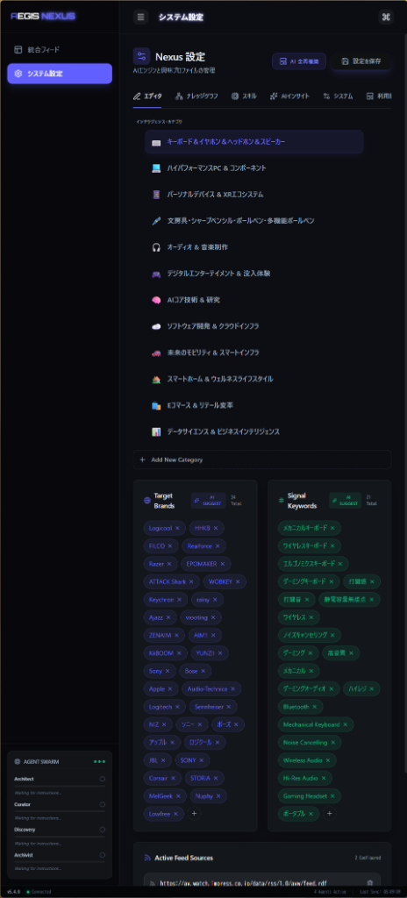

# Aegis Nexus 🛡️🤖

<p align="center">
  
</p>

<p align="center">
  <strong>The Ultimate Autonomous Intelligence Command Center powered by Gemini 3.x</strong><br>
  <i>Gemini 3.x が駆動する、究極の自律学習型インテリジェンス・コマンドセンター</i>
</p>

<p align="center">
  
  
  
  
</p>

---

## 🌟 What is Aegis Nexus? / Aegis Nexus とは？

**[EN]**  
Aegis Nexus is a next-generation, self-evolving news dashboard that transforms the way you consume information. Built with the **Gemini 3 Series (Flash 3.5 / Pro 3.1)** as its core engine and wrapped in a stunning **Windows 11 Acrylic Glassmorphism** interface, it filters the noise to deliver pure intelligence.

It doesn't just show you news; it **learns** your interests, **discovers** new sources, and **evolves** your knowledge base autonomously.

**[JP]**  
Aegis Nexus は、情報の消費スタイルを根本から変える次世代の自律進化型ニュースダッシュボードです。中枢に **Gemini 3 シリーズ (Flash 3.5 / Pro 3.1)** を据え、Windows 11 に最適化された美しい **Acrylic Glassmorphism** インターフェースを採用。ノイズを削ぎ落とし、真に価値のあるインテリジェンスのみを届けます。

単にニュースを表示するだけではありません。あなたの興味を**学習**し、新しい情報源を**発見**し、自律的にナレッジベースを**進化**させます。

---

## ✨ Key Features / 主な機能

### 🛡️ Aegis Chroma (Stunning UI/UX / 圧倒的なビジュアル)
- **Acrylic Glassmorphism**: A beautiful, translucent interface that blends perfectly with your Windows 11 desktop.  
  *Windows 11 デスクトップと完璧に調和する、美しく透き通ったインターフェース。*
- **Dynamic Theme Engine**: Seamlessly switches between Light, Dark, and System modes with real-time OS synchronization.  
  *OSの設定とリアルタイムに同期するライト/ダーク/システムモード。*

### 🧠 Deep AI Discovery (AIによる自律探索)
- **Autonomous Sourcing**: Gemini 3.5 Flash proactively explores the web to find high-quality RSS/Atom feeds based on your niche interests.  
  *Gemini 3.5 Flash が Web を能動的に探索し、あなたのニッチな関心に沿った高品質な情報源を発見。*
- **AI Insights**: Automatically extracts emerging trends and suggests new keywords to refine your personal feed.  
  *最新記事からトレンドを自動抽出し、フィードを洗練させるためのキーワードを提案。*

### ⚡ Precision Engineering (精密な設計)
- **Signal vs Noise**: Advanced scoring algorithm filters out the clutter, ensuring you only see what matters.  
  *高度なスコアリングアルゴリズムが不要な情報を排除。*
- **Image Enrichment**: Auto-extracts high-quality visuals and OGP data even from sites that lack proper metadata.  
  *メタデータのないサイトからも高品質な画像とOGPデータを自動抽出。*

### 🔒 Privacy & Local First (プライバシー重視)
- **Zero Telemetry**: Your interests and data stay on your machine.  
  *あなたの興味やデータはすべてローカルに保存。外部への送信は一切ありません。*
- **Secure Storage**: API keys are protected using OS-native encryption via Electron `safeStorage`.  
  *APIキーは OS ネイティブの暗号化（safeStorage）で安全に保護。*

---

## 📸 Screenshots / スクリーンショット

### 🛰️ Intelligence Dashboard / インテリジェンス・ダッシュボード
*A clean, distraction-free view of your curated world.*  
*AIによって厳選された、ノイズのない世界。*  


### 🛠️ Nexus Command / ネクサス・コマンド
*Manage your interests and control the AI evolution.*  
*興味関心の管理と、AI進化のコントロール。*  


---

## 🚀 Quick Start / クイックスタート

### 1. Prerequisites / 前提条件
- **Node.js** v20+
- **Google Gemini API Key** (Get it at [Google AI Studio](https://aistudio.google.com/app/apikey))

### 2. Installation / インストール
```bash
# Clone the repository / リポジトリをクローン
git clone https://github.com/charge0315/aegis-ai-hub.git
cd aegis-ai-hub

# Install dependencies / 依存関係のインストール
npm install
```

### 3. Launch / 起動
```bash
# Run in development mode / 開発モードで実行
npm run electron:dev

# Or build the production installer (EXE) / または製品版インストーラーを生成
npm run electron:build
```

---

## 👨‍💻 For Developers / 開発者の方へ

**[EN]** Aegis Nexus is a production-ready application with a sophisticated hybrid architecture.  
**[JP]** Aegis Nexus は、洗練されたハイブリッドアーキテクチャを備えたプロダクションレディなアプリケーションです。

- [**Technical Details & Engineering Specifications (技術仕様)**](./docs/TECHNICAL_DETAILS.md)
- [**System Codemaps (システム構成図)**](./docs/CODEMAPS/INDEX.md)

---

<p align="center">
  <i>Aegis Nexus - Precision Engineering for Intellectual Excellence. 🚀</i>
</p>
