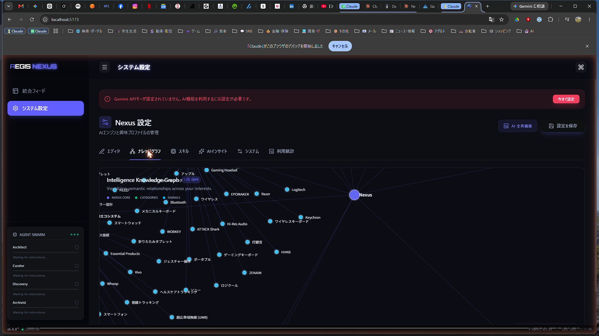

<div align="center">


# AEGIS NEXUS

### The Autonomous AI Intelligence Command Center

**Powered by Gemini 3.x · Built for Windows 11**

[](https://github.com/charge0315/aegis-ai-hub/releases)
[](https://aistudio.google.com)
[](https://www.microsoft.com/windows)
[](LICENSE)
[](https://electronjs.org)
[](https://react.dev)

*Stop drowning in noise. Start commanding intelligence.*  
*ノイズに溺れるのをやめ、インテリジェンスを掌握せよ。*

</div>

---

## 📸 見てください

<div align="center">

### 🛰️ Intelligence Dashboard — 148 articles, zero noise


### 🧠 Nexus Command — AI-powered knowledge profile editor


### 🕸️ Intelligence Knowledge Graph — Live semantic map of your interests



</div>

---

## 🌟 Aegis Nexus とは？

Aegis Nexus は **自律学習型のパーソナル AI インテリジェンス・ダッシュボード** です。  
単なるニュースリーダーではありません。あなたの興味を学習し、Web を能動的に探索し、価値のある情報だけを届ける **AI エージェントの司令塔** です。

**EN:** Aegis Nexus is a self-evolving AI intelligence hub that learns your interests, autonomously discovers high-quality sources across the web, and delivers curated knowledge — wrapped in a stunning Windows 11 Acrylic Glassmorphism interface.

> **"It doesn't just show news. It thinks, learns, and evolves."**

---

## ✨ 主な機能 / Key Features

<table>
<tr>
<td width="50%">

### 🤖 AI Agent Swarm
4つの専門 AI エージェントが並列稼働：

- **Architect** — カテゴリ構造を最適化
- **Curator** — 関連記事をスコアリング
- **Discovery** — 新しい情報源を自律探索
- **Archivist** — トレンドと知識を学習・蓄積

</td>
<td width="50%">

### 🛡️ Aegis Chroma UI
次世代の Windows 11 ネイティブ体験：

- **Acrylic Glassmorphism** — 透明感のある美しいUI
- **Dynamic Theme** — OS連動のダーク/ライトモード
- **Command Palette** — `Ctrl+K` で全機能即時アクセス
- **Knowledge Graph** — D3.js インタラクティブ意味マップ

</td>
</tr>
<tr>
<td width="50%">

### ⚡ Deep AI Discovery
Gemini 3.1 が Web を能動的に探索：

- RSS/Atom フィードの自律発見
- Google News RSS フォールバック
- OGP 画像の自動エンリッチメント
- カテゴリ名の AI 正規化・揺れ吸収

</td>
<td width="50%">

### 🔒 Privacy-First & Local
あなたのデータはあなたのものです：

- **Zero Telemetry** — 外部送信一切なし
- **safeStorage 暗号化** — OS ネイティブ暗号でAPIキーを保護
- **Local JSON** — DB 不要、すべてローカルに永続化
- **3世代バックアップ** — データ損失ゼロの設計

</td>
</tr>
</table>

---

## 🚀 クイックスタート / Quick Start

### 前提条件

- **Node.js** v20+
- **Google Gemini API Key** → [Google AI Studio で無料取得](https://aistudio.google.com/app/apikey)

### インストール

```bash
git clone https://github.com/charge0315/aegis-ai-hub.git
cd aegis-ai-hub
npm install
```

### 起動

```bash
# 開発モードで起動 (Electron + Vite HMR)
npm run electron:dev

# Windows 11 インストーラー (.exe) をビルド
npm run dist
```

起動後、**オンボーディング画面** の指示に従って Gemini API キーを設定するだけです。  
設定は OS ネイティブ暗号化で自動保護されます。

---

## 🏗️ アーキテクチャ / Architecture

```
┌─────────────────────────────────────────────────────────┐
│                   Electron Main Process                  │
│  ┌──────────────────┐   ┌────────────────────────────┐  │
│  │ ElectronSettings │   │   Fastify API Server        │  │
│  │ (safeStorage)    │   │   (localhost only, CORS)    │  │
│  └──────────────────┘   └──────────┬─────────────────┘  │
└────────────────────────────────────┼────────────────────┘
                                     │ IPC / HTTP
┌────────────────────────────────────┼────────────────────┐
│                React Renderer      │                     │
│  ┌─────────────┐  ┌────────────┐  │  ┌───────────────┐  │
│  │  Dashboard  │  │   Nexus    │  │  │  Agent Swarm  │  │
│  │  (Articles) │  │  Command   │  │  │  Status Panel │  │
│  └─────────────┘  └────────────┘  │  └───────────────┘  │
│  ┌─────────────────────────────────────────────────────┐ │
│  │           NexusOrchestrator                         │ │
│  │  Architect · Curator · Discovery · Archivist        │ │
│  └─────────────────────────────────────────────────────┘ │
└─────────────────────────────────────────────────────────┘
```

---

## 🛠️ Tech Stack

| Layer | Technology |
|-------|-----------|
| **Desktop Shell** | Electron 36 |
| **Frontend** | React 19 + TypeScript 6 + Vite 8 (Rolldown) |
| **Styling** | Tailwind CSS 4 + Glassmorphism |
| **AI Engine** | Google Gemini 3.1 Pro / Flash |
| **Backend API** | Fastify (embedded, localhost) |
| **Data Viz** | D3.js (Knowledge Graph) + Recharts (Usage) |
| **Animation** | Framer Motion |
| **Validation** | Zod |
| **Testing** | Vitest + Playwright |
| **Build** | electron-builder (NSIS installer) |

---

## 📁 ドキュメント / Documentation

| Document | Description |
|----------|-------------|
| [📋 SPECIFICATION](./docs/SPECIFICATION.md) | 機能仕様書 v5.4.0 |
| [🔧 TECHNICAL_DETAILS](./docs/TECHNICAL_DETAILS.md) | アーキテクチャ詳細 |
| [🤖 GEMINI](./docs/GEMINI.md) | Gemini 連携ガイド |
| [📖 Manual](./docs/aegis-hub-manual.md) | ユーザーマニュアル |
| [🐛 Troubleshooting](./docs/TROUBLESHOOTING_HISTORY.md) | トラブルシューティング履歴 |
| [🔍 Code Review History](./docs/REVIEW_RESULT.md) | コードレビュー履歴 (v5.3.0〜v5.4.0) |

---

## 🔑 セキュリティ / Security

- API キーは Electron `safeStorage`（OS ネイティブ暗号）で保護
- 平文キーを検出した場合は自動的に即時再暗号化
- CORS はローカルオリジン（`localhost:5173`）のみ許可
- 外部リンクはすべてシステムブラウザへルーティング
- `contextIsolation: true` / `nodeIntegration: false` 準拠

---

<div align="center">

**Aegis Nexus** — *Precision Engineering for Intellectual Excellence*

[⭐ Star this repo](https://github.com/charge0315/aegis-ai-hub) · [🐛 Report Bug](https://github.com/charge0315/aegis-ai-hub/issues) · [💡 Request Feature](https://github.com/charge0315/aegis-ai-hub/issues)

</div>
