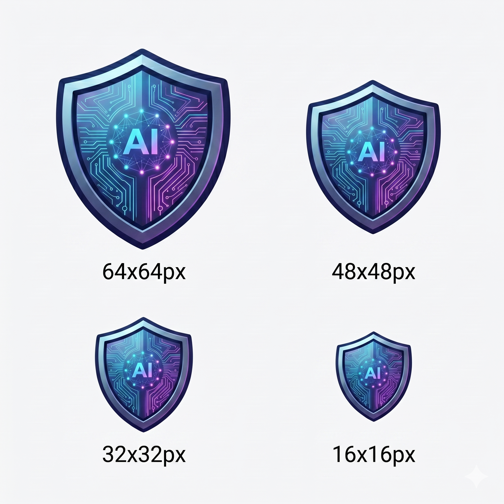

# Aegis Nexus 🛡️🤖

<p align="center">
  
</p>

<p align="center">
  <strong>The Ultimate Autonomous Intelligence Command Center powered by Gemini 3.1</strong>
</p>

<p align="center">
  
  
  
  
</p>

---

## 🌟 What is Aegis Nexus?

Aegis Nexus is a next-generation, self-evolving news dashboard that transforms the way you consume information. Built with the **Gemini 3.1 Series (Pro/Flash)** as its core engine and wrapped in a stunning **Windows 11 Acrylic Glassmorphism** interface, it filters the noise to deliver pure intelligence.

It doesn't just show you news; it **learns** your interests, **discovers** new sources, and **evolves** your knowledge base autonomously.

---

## ✨ Key Features

### 🛡️ Aegis Chroma (Stunning UI/UX)
- **Acrylic Glassmorphism**: A beautiful, translucent interface that blends perfectly with your Windows 11 desktop.
- **Dynamic Theme Engine**: Seamlessly switches between Light, Dark, and System modes with real-time OS synchronization.

### 🧠 Deep AI Discovery
- **Autonomous Sourcing**: Gemini 3.1 proactively explores the web to find high-quality RSS/Atom feeds based on your niche interests.
- **AI Insights**: Automatically extracts emerging trends and suggests new keywords to refine your personal feed.

### ⚡ Precision Engineering
- **Signal vs Noise**: Advanced scoring algorithm filters out the clutter, ensuring you only see what matters.
- **Image Enrichment**: Auto-extracts high-quality visuals and OGP data even from sites that lack proper metadata.

### 🔒 Privacy & Local First
- **Zero Telemetry**: Your interests and data stay on your machine.
- **Secure Storage**: API keys are protected using OS-native encryption via Electron `safeStorage`.

---

## 📸 Screenshots

### 🛰️ Intelligence Dashboard
*A clean, distraction-free view of your curated world.*


### 🛠️ Nexus Command
*Manage your interests and control the AI evolution.*


---

## 🚀 Quick Start

### 1. Prerequisites
- **Node.js** v20+
- **Google Gemini API Key** (Get it at [Google AI Studio](https://aistudio.google.com/app/apikey))

### 2. Installation
```bash
# Clone the repository
git clone https://github.com/charge0315/aegis-ai-hub.git
cd aegis-ai-hub

# Install dependencies
npm install
```

### 3. Launch
```bash
# Run in development mode
npm run electron:dev

# Or build the production installer (EXE)
npm run electron:build
```

---

## 👨‍💻 For Developers

Aegis Nexus is a production-ready application with a sophisticated hybrid architecture.
Detailed engineering specifications, architecture maps, and API references can be found here:

- [**Technical Details & Engineering Specifications**](./docs/TECHNICAL_DETAILS.md)
- [**System Codemaps**](./docs/CODEMAPS/INDEX.md)

---

<p align="center">
  <i>Aegis Nexus - Precision Engineering for Intellectual Excellence. 🚀</i>
</p>
