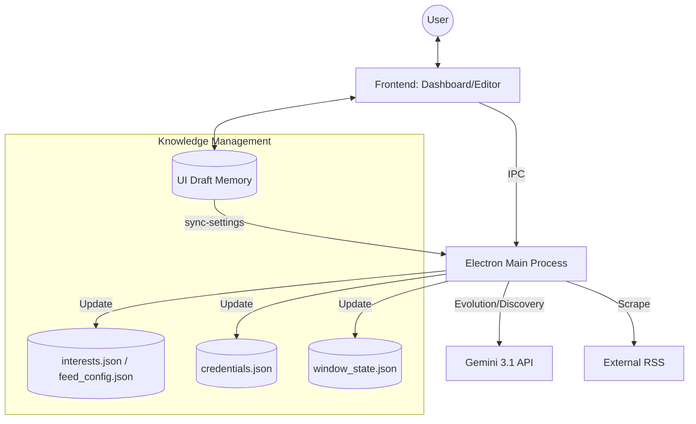

# Aegis AI Hub - System Index

**Project Status:** Production Ready (v5.2 NEXUS)
**Last Updated:** 2026-06-05

## プロジェクト概要
Aegis AI Hub は、Gemini 3.1 を中枢に据えた「自律学習型知的ダッシュボード」です。  
v5.2 NEXUS では、Windows 11 との親和性を極限まで高めた **Mica Glassmorphism** デザイン、React Portals による堅牢な UI アーキテクチャ、そして専門性の高い初期データセットを統合し、実用性と審美性を両立させた究極のインテリジェンス・ツールへと進化しました。

## 主要なアップデート (v5.2 NEXUS)

- **Windows 11 Native Integration**: Electron の `mica` マテリアルを適用。デスクトップと調和する高級感のあるすりガラス効果を実現。
- **Refined UI Architecture**: `CustomDialog` に **React Portals** を採用。 z-index やスクロールの影響を受けない完璧なオーバーレイ表示を実現。
- **Standardized Data Set**: ゲーム、AI、PCパーツ、オーディオ、XR等の高度なカテゴリとフィードを `SettingsManager` に内蔵。初回起動時から最高品質の情報を収集。
- **System Control**: `Ctrl+Q` による安全なアプリケーション終了や、動的なウィンドウ・コントロールを強化。

## 技術ドキュメント (Codemaps)

- [**Backend Architecture**](backend.md) - Mica 統合, 設定マネージャー, エージェント・オーケストレーション
- [**Frontend UI**](frontend.md) - Glassmorphism デザイン, React Portals, v5.2 UI 仕様
- [**API Reference**](../API.md) - 同期 API の詳細仕様
- [**Automation**](automation.md) - electron-builder によるパッケージング, E2E テスト

## システム全体俯瞰

## 主要モジュール構成

### Desktop Application (`dashboard/`)
- `electron/index.cjs`: ハイブリッド・エントリーポイント。開発時は `esbuild-register`、本番時は `main.bundle.cjs` を自動切り替え。
- `electron/services/SettingsManager.ts`: AppData 直下の `credentials.json` で API キーを管理。
- `src/components/UnifiedEditor.tsx`: 「System Settings」タブを搭載し、UI から API キーの設定が可能。

### Backend Services (Core Logic)
- `server/src/services/`: 
    - `GeminiService`: Gemini 3.1 による解析。`SettingsManager` から取得した API キーを使用。
    - `SettingsManager`: Zod を用いた設定のアトミックな同期とバリデーション。
- `server/src/core/`:
    - `NexusOrchestrator`: 自律的なインテリジェンス・サイクルの制御。

### Data Persistence
- プロダクション環境では、OS 標準のユーザーデータ領域 (`%APPDATA%` 等) に保存されます。
- `interests.json`: カテゴリ、ブランド、キーワード。
- `feed_config.json`: AI とユーザーが共同管理する情報源。
- `credentials.json`: **[NEW]** ユーザーが設定した API キー。
