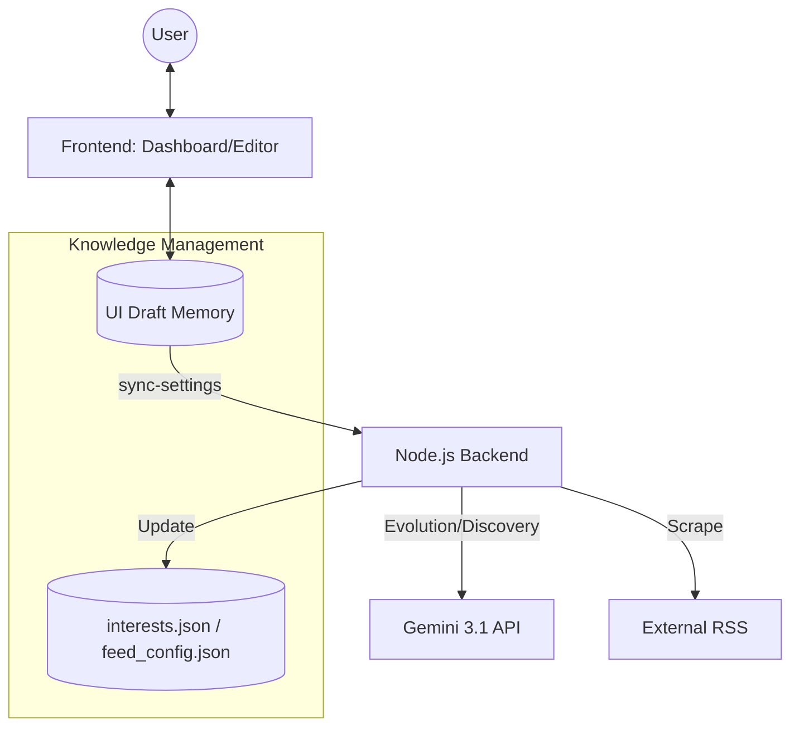

# Aegis AI Hub - System Index

**Project Status:** Next-Gen Architecture (v5.0)
**Last Updated:** 2026-04-26

## プロジェクト概要
Aegis AI Hub は、Gemini 3.1 を中枢に据えた「自律学習型知的ダッシュボード」です。  
v5.0 では、設定画面の統合と「下書き（Draft）」ベースのワークフローを導入し、AIの進化を人間が直感的にコントロールできる環境へと昇華しました。

## 技術ドキュメント (Codemaps)

- [**Backend Architecture**](backend.md) - SOA, 自律進化ジョブ, `sync-settings` API
- [**Frontend UI**](frontend.md) - 統合エディタ, 下書きワークフロー, Fluentデザイン
- [**API & MCP Reference**](../API.md) - 同期 API と MCP ツールの詳細仕様
- [**Automation**](automation.md) - スタートアップ自動化と Docker 構成

## システム全体俯瞰

## 主要モジュール構成

### Backend (`server/`)
- `index.js`: API サーバー、MCP サーバー、同期ロジックの統括。
- `src/services/`: 
    - `DiscoveryService`: AI による新サイト探索。
    - `GeminiService`: キュレーション、構造再構築の提案。
    - `FeedManager`: フィード構成の永続化と管理。
- `src/jobs/`: 
    - `EvolutionJob`: 記事トレンドからの継続学習。

### Frontend (`dashboard/`)
- `js/app.js`: アプリケーション・ロジック、下書き（Draft）管理、AI提案の適用。
- `js/ui.js`: Fluentデザインに基づくレンダリング、統合エディタのタブ切り替え。
- `js/store.js`: 記事データ、表示モード（Grid/List）、既読状態の管理。
- `js/api.js`: `/api/sync-settings` を含むバックエンド通信。

### Data (`data/`)
- `interests.json`: カテゴリ、ブランド、キーワード。
- `feed_config.json`: AI とユーザーが共同管理する情報源。
