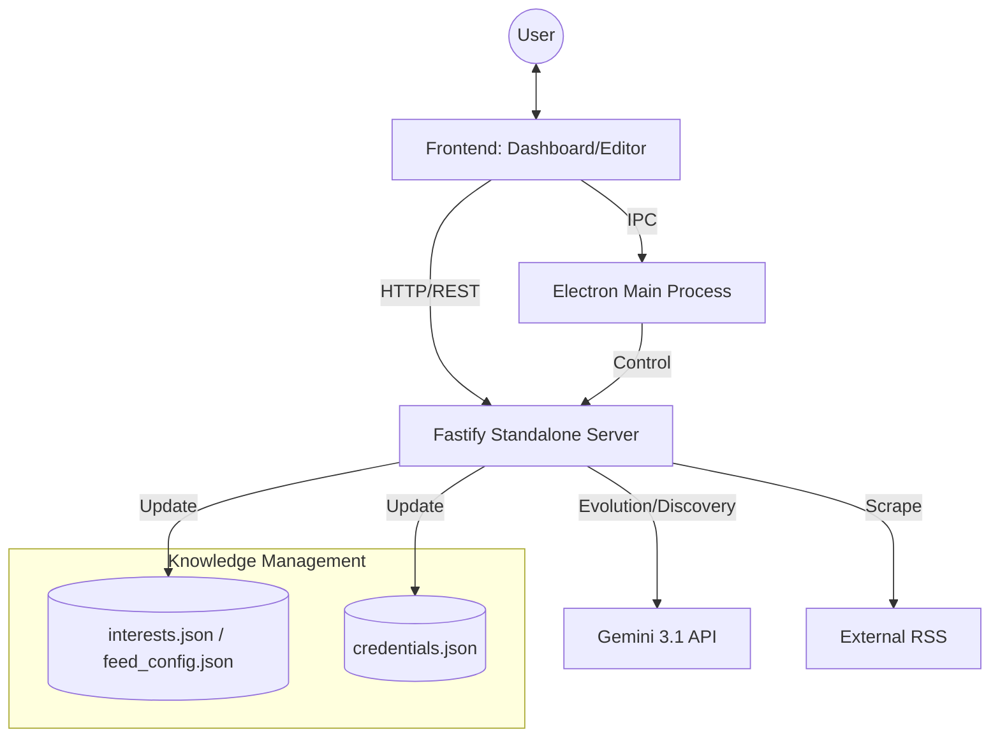

# Aegis AI Hub - System Index

**Project Status:** Production Ready (v5.2 NEXUS)
**Last Updated:** 2026-06-15

## プロジェクト概要
Aegis AI Hub は、Gemini 3.1 を中枢に据えた「自律学習型知的ダッシュボード」です。  
v5.2 NEXUS では、Windows 11 との親和性を極限まで高めた **Acrylic Glassmorphism** デザイン、Fastify によるスタンドアロンサーバー構成、そして柔軟な UI アーキテクチャを統合しました。

## 主要なアップデート (v5.2 NEXUS)

- **Windows 11 Native Integration**: Electron の `acrylic` マテリアルを適用。FancyZones に対応し、デスクトップと調和する高度な透過効果を実現。
- **Fastify Standalone Server**: MCP 構成から Fastify ベースの高性能サーバーへ移行。`@modelcontextprotocol/sdk` を排除し、軽量化と汎用性を両立。
- **Refined UI Architecture**: 縦スクロールの最適化、ヘッダーとサイドバーの透過デザイン統一、React Portals による堅牢なダイアログ実装。
- **Standardized Data Set**: ゲーム、AI、PCパーツ等の高度なカテゴリを内蔵。初回起動時から最高品質の情報を収集。
- **Background Residency & Auto-Launch**: システムトレイ常駐と Windows 起動時の自動実行に対応。

## 技術ドキュメント (Codemaps)

- [**Backend Architecture**](backend.md) - Fastify サーバー, 設定マネージャー, エージェント・オーケストレーション
- [**Frontend UI**](frontend.md) - Acrylic デザイン, React Portals, v5.2 UI 仕様
- [**API Reference**](../API.md) - Fastify & IPC API の詳細仕様
- [**Automation**](automation.md) - electron-builder によるパッケージング, E2E テスト

## システム全体俯瞰

## 主要モジュール構成

### Desktop Application (`dashboard/`)
- `electron/main.cjs`: **Acrylic 素材**を有効化したメインウィンドウ管理。
- `src/api/nexusApi.ts`: Electron IPC と HTTP API の両対応ブリッジ。

### Backend Services (`server/`)
- `src/index.ts`: **Fastify サーバー**のエントリーポイント。
- `src/services/GeminiService`: Gemini 3.1 による解析。
- `src/core/NexusOrchestrator`: 自律的なインテリジェンス・サイクルの制御。

### Data Persistence
- プロダクション環境では、OS 標準のユーザーデータ領域 (`%APPDATA%` 等) に保存されます。
- `interests.json`: カテゴリ、ブランド、キーワード。
- `feed_config.json`: AI とユーザーが共同管理する情報源。
- `credentials.json`: ユーザーが設定した API キー。
