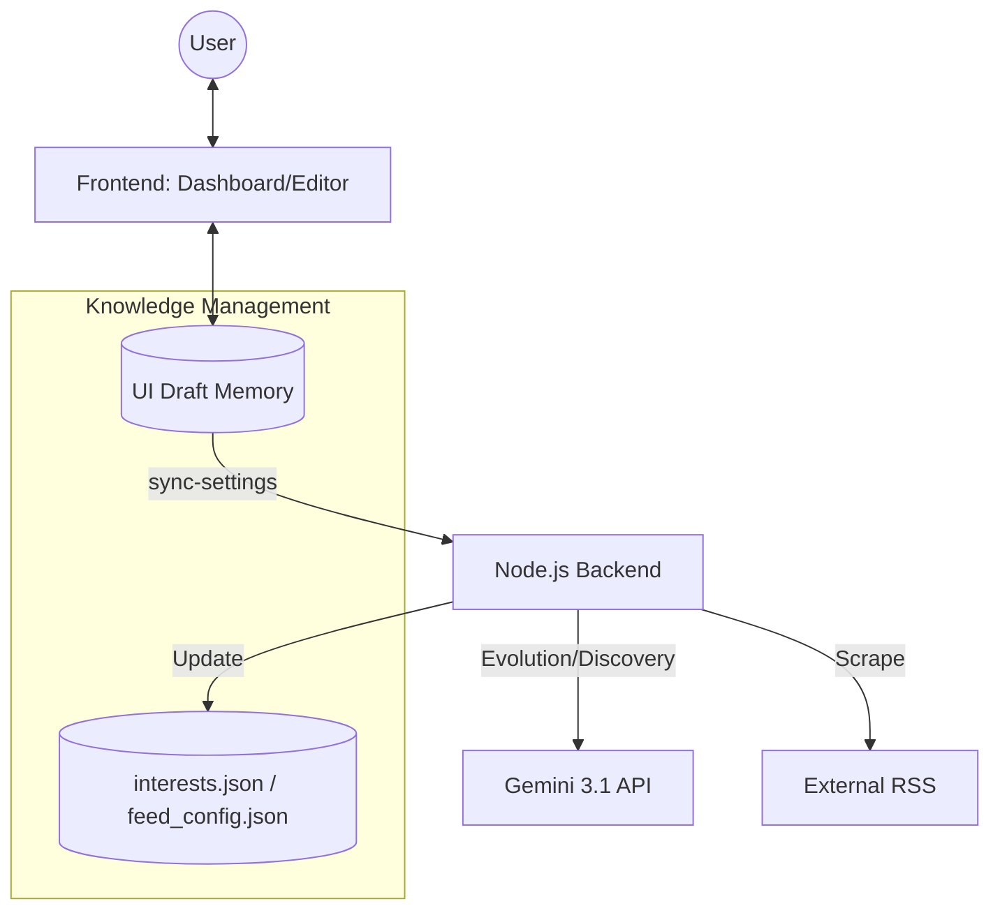

# Aegis AI Hub - System Index

**Project Status:** Next-Gen Architecture (v5.0)
**Last Updated:** 2026-04-27

## プロジェクト概要
Aegis AI Hub は、Gemini 3.1 を中枢に据えた「自律学習型知的ダッシュボード」です。  
v5.0 では、設定画面の統合（Nexus Editor）と「下書き（Draft）」ベースのワークフロー、そしてエージェントスキルの直接制御（Skill Registry）を導入し、AIの進化を人間が直感的にコントロールできる環境へと昇華しました。

## 技術ドキュメント (Codemaps)

- [**Backend Architecture**](backend.md) - SOA, 自律進化ジョブ, `sync-settings` API, SSE
- [**Frontend UI**](frontend.md) - Nexus Editor, Skill Registry, Fluentデザイン, React/Vite
- [**API & MCP Reference**](../API.md) - 同期 API と MCP ツールの詳細仕様
- [**Automation**](automation.md) - スタートアップ自動化 (Windows/Docker) とライフサイクル管理

## システム全体俯瞰

## 主要モジュール構成

### Backend (`server/`)
- `src/index.ts`: Fastify サーバー、MCP サーバー、静的配信、SSE 通信の統括。
- `src/services/`: 
    - `GeminiService`: Gemini 3.1 Pro Preview / Flash による高度な解析。
    - `DiscoveryService`: AI による新しい RSS 情報源の探索。
    - `SettingsManager`: `interests.json` と `feed_config.json` のアトミックな同期。
- `src/core/`:
    - `NexusOrchestrator`: 自律的なインテリジェンス・サイクルの制御。

### Frontend (`dashboard/`)
- `src/App.tsx`: React アプリケーションのエントリポイント、状態管理。
- `src/components/`:
    - `UnifiedEditor.tsx`: 下書きベースの設定編集、カテゴリ操作、スキル管理。
    - `KnowledgeGraph.tsx`: 興味関心の視覚化。
    - `SkillRegistry.tsx`: エージェントスキルの制御インターフェース。
- `src/api/nexusApi.ts`: バックエンド API (`/api/v5/*`) との通信。

### Data (`data/`)
- `interests.json`: カテゴリ、ブランド、キーワード。
- `feed_config.json`: AI とユーザーが共同管理する情報源。
