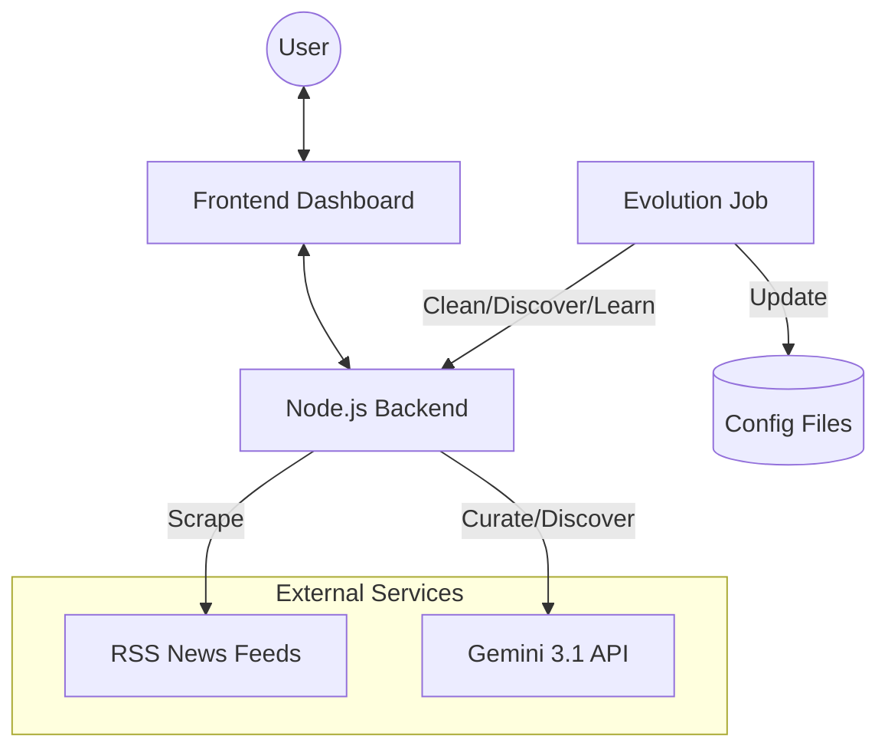

# Aegis AI Hub - System Index

**Project Status:** Ultimate Architecture (v5.0)
**Last Updated:** 2026-04-25

## プロジェクト概要
ユーザーの好みに完全に最適化された「自律型知的ダッシュボード」。  
AIによるキュレーション、自律的なサイト発見、ナレッジの自動再構築、セキュアなUIを統合した進化型サービス指向システムです。

## 技術ドキュメント (Codemaps)

- [**Backend Architecture**](backend.md) - SOA、自律進化ジョブ、AIナレッジ再構築
- [**Frontend UI**](frontend.md) - ドロワーメニュー、進化提案モーダル、XSS対策
- [**API & MCP Reference**](../API.md) - エンドポイントとMCPツールの仕様
- [**Automation**](automation.md) - スタートアップ自動化、Docker、定期ジョブ

## システム全体俯瞰

## 主要モジュール構成

### Backend (`server/`)
- `index.js` - API & MCP サーバー、レート制限の実装
- `ScraperFacade.js` - 取得・判定・整形・AI推論を統括する司令塔
- `services/` - `DiscoveryService` (AIサイト発見), `GeminiService` (キュレーション & 再構築), `RSSFetcher` 等
- `jobs/` - `EvolutionJob` (自律進化), `HealthMonitor` (死活監視)

### Frontend (`dashboard/`)
- `js/ui.js` - ドロワーメニュー、進化提案モーダル、エスケープ処理
- `js/app.js` - 進化・再構築の適用ロジック
- `index.html` - 常時表示ハンバーガーメニュー、グラスモーフィズム UI

### Data (`data/`)
- `interests.json` - パーソナライズ設定（学習済みキーワード含む）
- `feed_config.json` - フィードURL（AIにより自動拡張）
