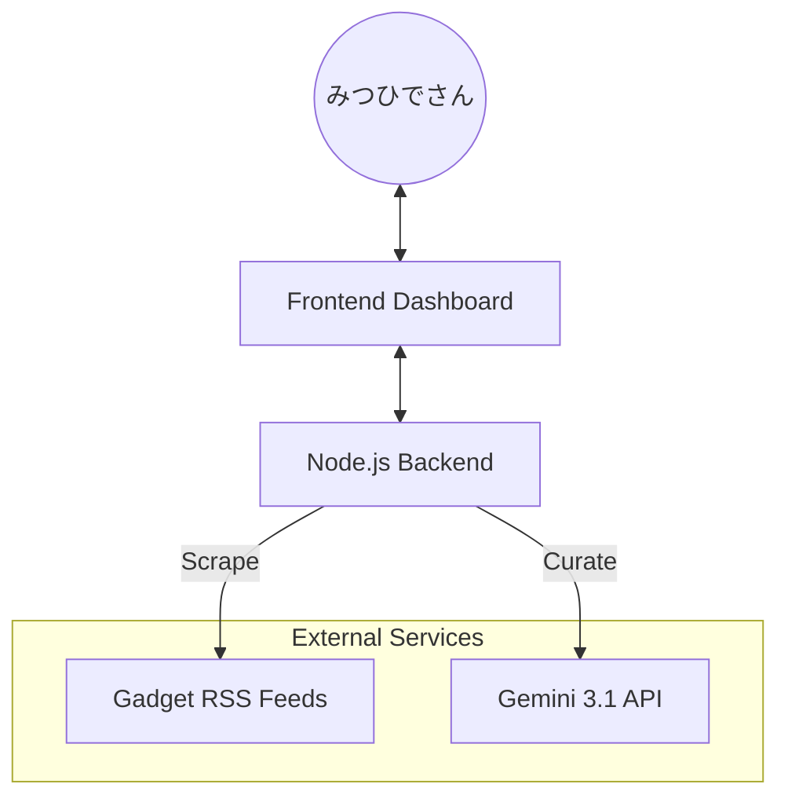

# Gadget Concierge Plus - System Index

**Project Status:** Ultimate Architecture (v3.1)
**Last Updated:** 2026-04-21

## プロジェクト概要
みつひでさんの好みに完全に最適化された「究極のガジェットダッシュボード」。  
AIによるキュレーション、高速な並列スクレイピング、セキュアなUIを統合したサービス指向システムです。

## 技術ドキュメント (Codemaps)

- [**Backend Architecture**](backend.md) - SOA、AIフォールバック、セキュリティ
- [**Frontend UI**](frontend.md) - Vanilla JS、Tailwind CSS、XSS対策
- [**Automation**](automation.md) - スタートアップ自動化、Docker

## システム全体俯瞰

## 主要モジュール構成

### Backend (`server/`)
- `index.js` - API & MCP サーバー、レート制限の実装
- `ScraperFacade.js` - 並列取得・スコアリング・抽出のオーケストレーター
- `services/` - `GeminiService`, `RSSFetcher`, `FeedManager` 等の個別責務

### Frontend (`dashboard/`)
- `js/ui.js` - レンダリングとエスケープ処理
- `js/store.js` - 検索・既読状態の永続化
- `index.html` - Tailwind CSS ベースの UI 構造

### Data (`server/data/`)
- `interests.json` - パーソナライズ設定（カテゴリ、ブランド）
- `feed_config.json` - フィードURLと稼働状況の管理
