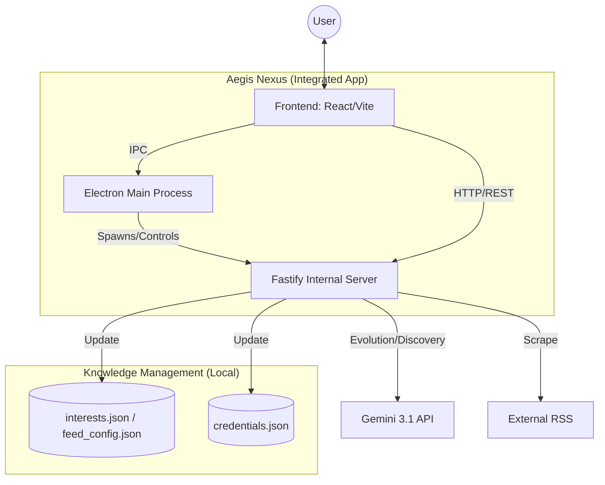

# Aegis AI Hub - System Index

**Project Status:** Production Ready (v5.3.0 NEXUS)
**Last Updated:** 2026-05-21

## プロジェクト概要
Aegis AI Hub は、Gemini 3.1 を中枢に据えた「自律学習型知的ダッシュボード」です。  
v5.3.0 NEXUS では、AI によるプロファイルの完全再構築、カテゴリ名の不一致を解消する整合性強制ロジック、およびデータの完全保持リカバリーを導入しました。
また、プロジェクト全体の大規模なリファクタリングにより、コード品質と保守性が大幅に向上しました。

## 主要なアップデート (v5.3.0 NEXUS)

- **Advanced AI Restructure v2**: カテゴリの再編、既存フィードの最適な再割り当て、および高品質な RSS ソースの自動発見を統合。
- **Category Name Normalization**: AI の生成するカテゴリ名の揺れ（記号や空白）を正規化し、購読フィードが消失する問題を物理的に解決。
- **Data Retention Recovery**: AI が返し忘れたブランドやキーワードを自動検知し、既存データから強制復元する保護機能を実装。
- **SettingsManager Singletonization & Backup**: 設定管理ロジックをシングルトン化し、最大3世代の自動バックアップ（.bak, .bak2, .bak3）機能を搭載。
- **Data Model Unification**: Zod スキーマによるデータ構造の厳格な統一とバリデーションを徹底。
- **Component Refactoring**: `UnifiedEditor` 等の巨大なコンポーネントを機能単位に分割（`editors/` 配下）し、可読性と再利用性を向上。
- **Unit Testing Framework**: Vitest によるユニットテストを導入し、コアロジック（SettingsManager 等）の信頼性を担保。
- **Parallel Verification Logic (`Promise.all`)**: 検証プロセスの高速化。
- **Google News RSS Fallback**: 提案ソース枯渇時の自動補完。
- **AI Insights & Continuous Learning**: `Archivist` エージェントが発見したトレンドキーワードを管理・承認するための専用タブを導入。
- **UX Progress & Non-blocking Loading**: AI による長時間処理中の詳細表示と非ブロッキング・モード。
- **Intelligent Multi-language Support**: 正規表現による日本語判定、優先ソート、および「JA Only」フィルタを実装。
- **Setup Guard**: 初回起動検知と、既存設定の上書き防止プロセスによるデータ保護。
- **Gemini Model Optimization**: 実行直前の API Key 即時同期と Schema Resilience (`minItems: 1`) を導入。

## 主要なアップデート (v5.2 NEXUS)

- **RSS Health Check & Auto-Recovery**: `RSSFetcher` によるバリデーションと、`FeedManager` による代替フィードへの自動昇格機能を搭載。故障したフィードを自律的に検知・置換します。
- **Image Acquisition & Caching**: `ImageCacheManager` による画像URLの永続化、`EnrichmentService` でのスクレイピング強化（Cheerio/Axios）、および `p-limit` による同時実行数制御を導入。
- **Forced Validation Guardrails**: フィードの追加や同期時にヘルスチェックを強制し、無効なフィードの登録を未然に防ぎます。
- **Adaptive Data Path Resolution**: 開発環境（プロジェクトルート）とプロダクション環境（AppData）でデータ保存先を自動的に切り替え。
- **Article Freshness Filtering**: 90日以上前の記事を自動的に除外するロジックを実装。
- **Standardized Data Set (May 2026)**: 2026年5月のトレンドに基づき、12カテゴリーのキーワードとブランドリストを大幅に充実。
- **Fastify Integrated Server**: MCP 構成から Fastify ベースの高性能サーバーへ移行し、Electron アプリケーション内へ完全統合。軽量化と単一プロジェクトによる保守性の向上を両立。

## 技術ドキュメント (Codemaps)

- [**Backend Architecture**](backend.md) - Fastify サーバー, 設定マネージャー, エージェント・オーケストレーション
- [**Frontend UI**](frontend.md) - Acrylic デザイン, React Portals, v5.2 UI 仕様
- [**API Reference**](../API.md) - Fastify & IPC API の詳細仕様
- [**Automation**](automation.md) - electron-builder によるパッケージング, E2E テスト

## システム全体俯瞰

```mermaid
graph TD
    User((User))
    
    subgraph "Aegis Nexus (Integrated App)"
        UI[Frontend: React/Vite]
        Main[Electron Main Process]
        Server[Fastify Internal Server]
        
        Main -- Spawns/Controls --> Server
        UI -- IPC --> Main
        UI -- HTTP/REST --> Server
    end
    
    subgraph "Knowledge Management (Local)"
        Config[(interests.json / feed_config.json)]
        Creds[(credentials.json)]
    end

    User <--> UI
    
    Server -- Evolution/Discovery --> GeminiAPI[Gemini 3.1 API]
    Server -- Scrape --> Feeds[External RSS]
    Server -- Update --> Config
    Server -- Update --> Creds
```

## 主要モジュール構成

### Application Core
- `electron/main.cjs`: **Acrylic 素材**を有効化したメインウィンドウ管理。Fastify サーバーの起動制御も担当。
- `src/api/server/NexusRouter.ts`: 内蔵 **Fastify サーバー** のルーティング定義。
- `src/api/nexusApi.ts`: Electron IPC と HTTP API の両対応ブリッジ。

### Intelligence & Logic (`src/`)
- `services/GeminiService.ts`: Gemini 3.1 による解析・探索ロジック。
- `core/NexusOrchestrator.ts`: 自律的なインテリジェンス・サイクルの制御。
- `agents/`: 各種自律エージェント（Architect, Archivist, etc.）。
- `jobs/`: 進化サイクルやヘルスチェック等の定期タスク。

### Data Persistence
- プロダクション環境では、OS 標準のユーザーデータ領域 (`%APPDATA%` 等) に保存されます。
- `interests.json`: カテゴリ、ブランド、キーワード。
- `feed_config.json`: AI とユーザーが共同管理する情報源。
- `credentials.json`: ユーザーが設定した API キー。Electronの `safeStorage` によってOSレベルで安全に暗号化されます。
